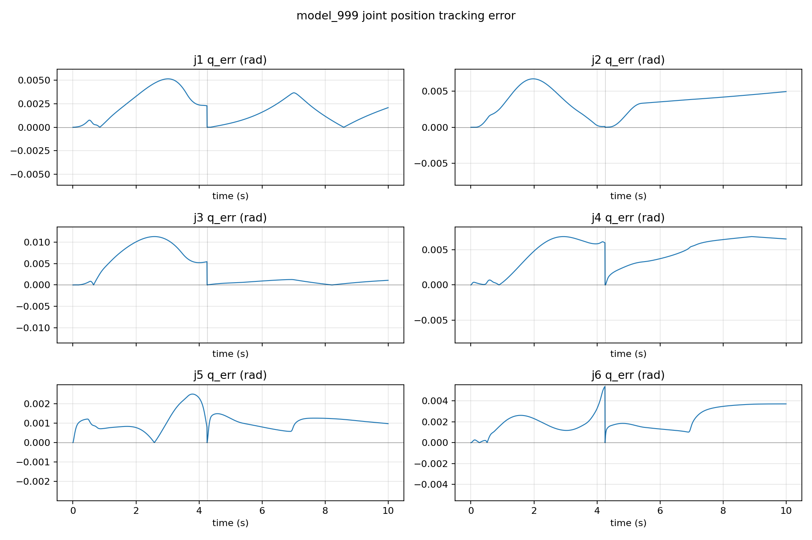
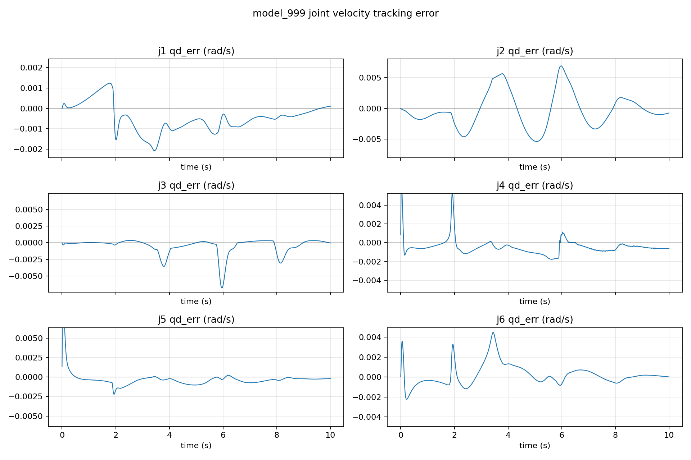
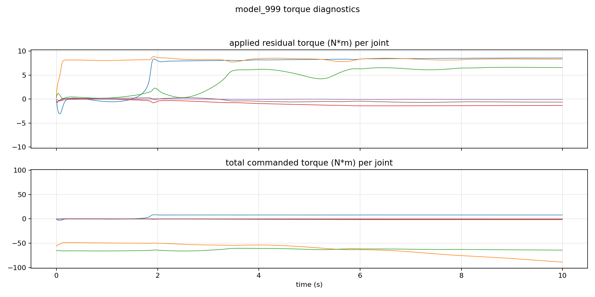
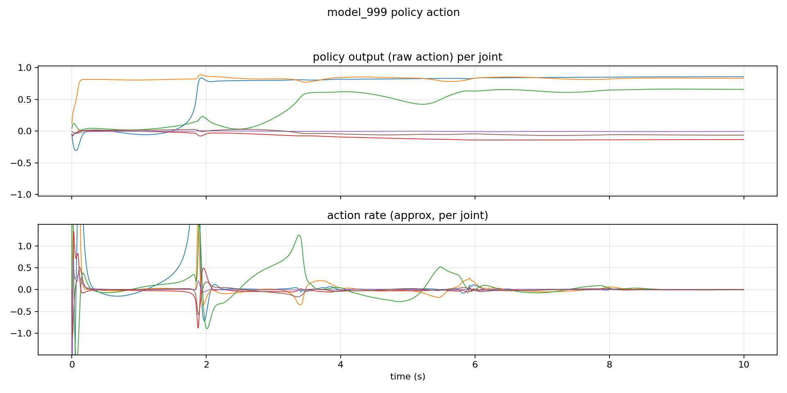

# Milestone: friction + residual — model_999

## Snapshot

- Checkpoint: `checkpoints/model_999.pt`
- Source run (original logs): `logs/rsl_rl/neuarm_irb2400_tracking/2026-01-02_22-02-51`
- Eval: TCP site, 2000 steps

## Metrics (eval)

- Original sealed (2026-01-02): TCP mean `6.245mm`, Joint RMSE mean `0.002163rad`, Residual p95 `8.569N·m`
- Deterministic replay (`seed=0`): TCP mean `7.707mm`, Joint RMSE mean `0.0033rad`, Residual p95 `8.586N·m`

## Plots

## One‑click

- Train: `bash train.sh`
- Eval: `bash eval.sh`
- Replay (viewer): `bash play.sh`
