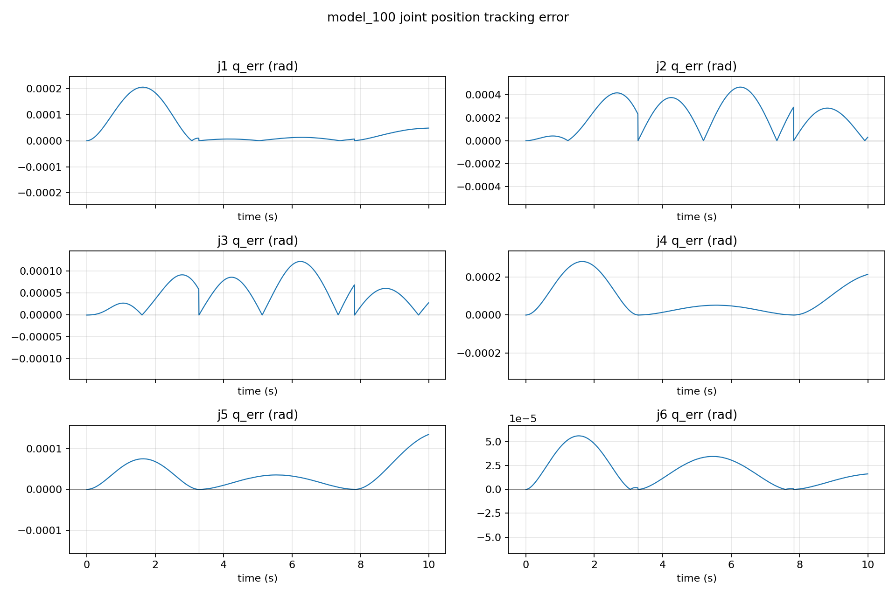
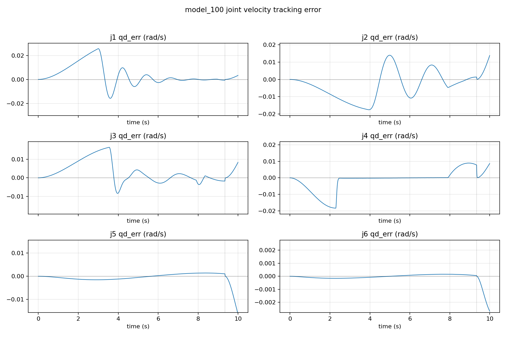
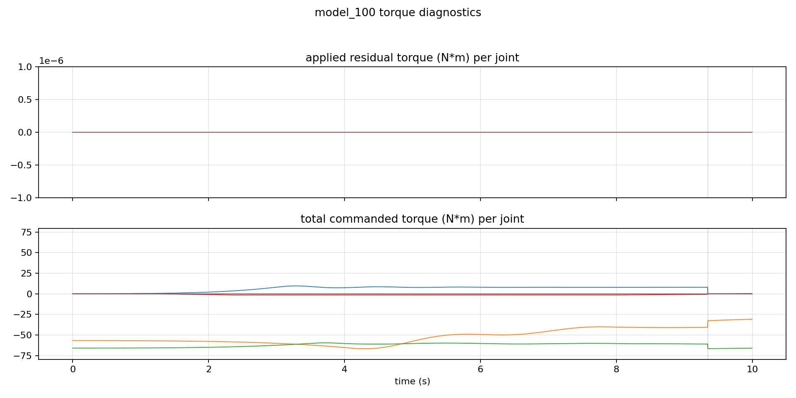
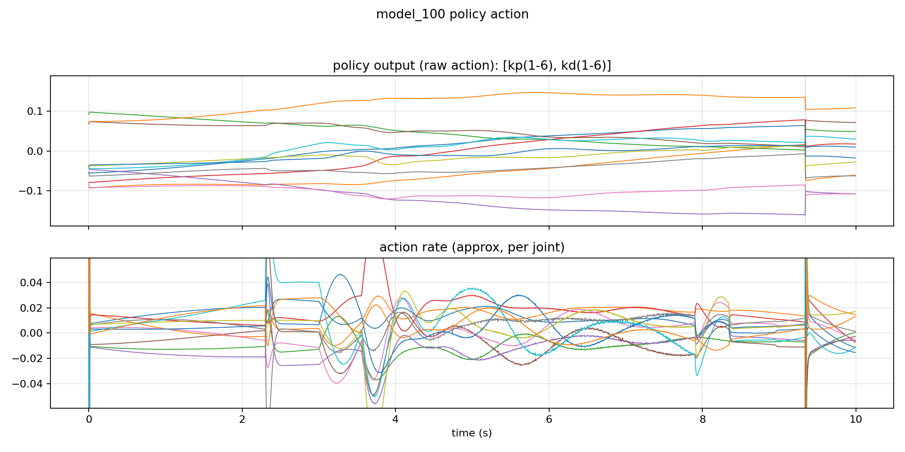

# Milestone: frictionless (damping=0) — model_100

## Snapshot

- Checkpoint: `checkpoints/model_100.pt`
- Source run (original logs): `logs/rsl_rl/neuarm_irb2400_tracking/2026-01-02_18-06-29`
- Eval: TCP site, 2000 steps

## Metrics (eval)

- Joint RMSE (rad): mean `5.02e-05`, p95 `1.33e-04`, max `1.37e-04`
- TCP error (mm): mean `0.147`, p95 `0.380`, max `0.392`

## Plots

## One‑click

- Train: `bash train.sh`
- Eval: `bash eval.sh`
- Replay (viewer): `bash play.sh`

